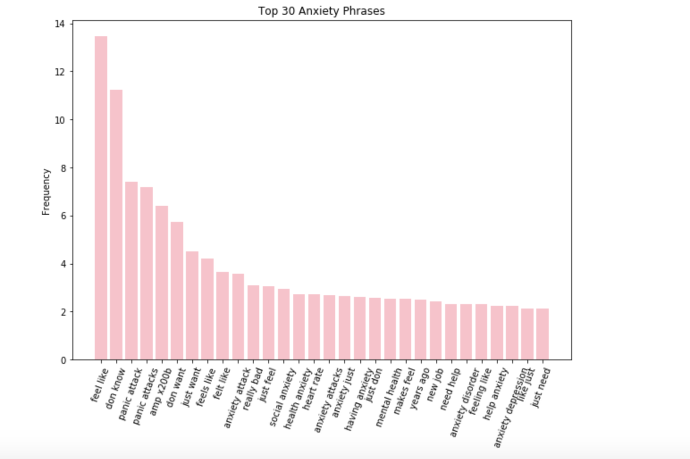
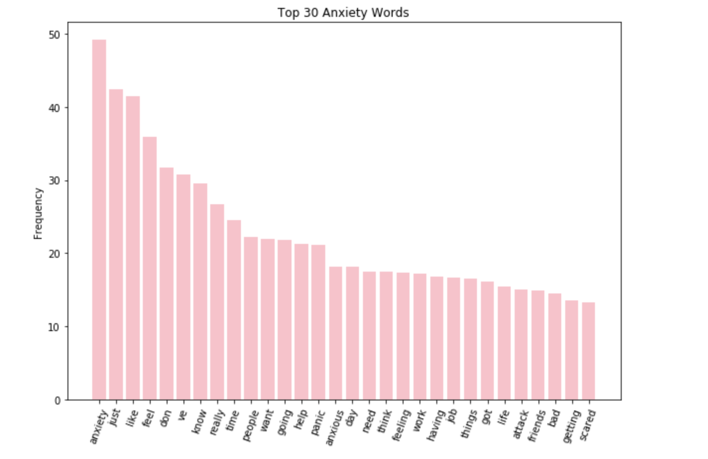
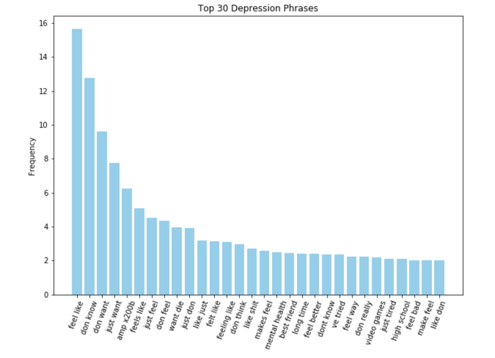
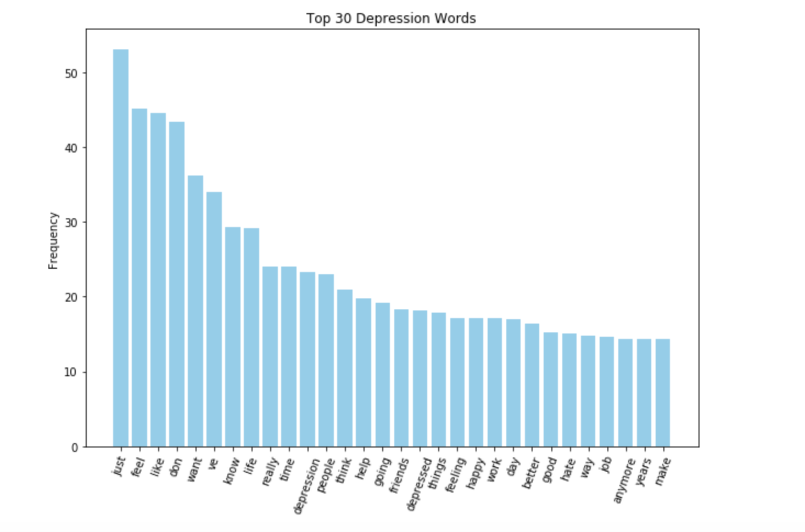
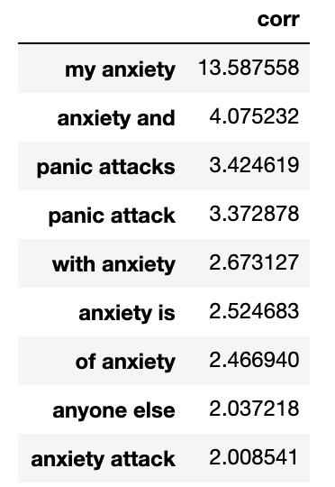
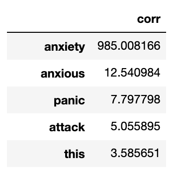
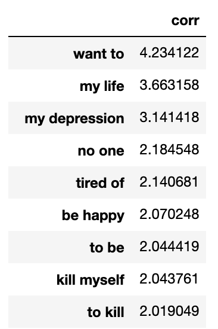
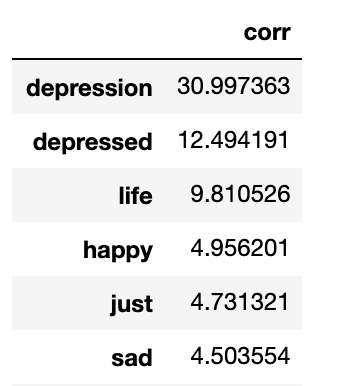
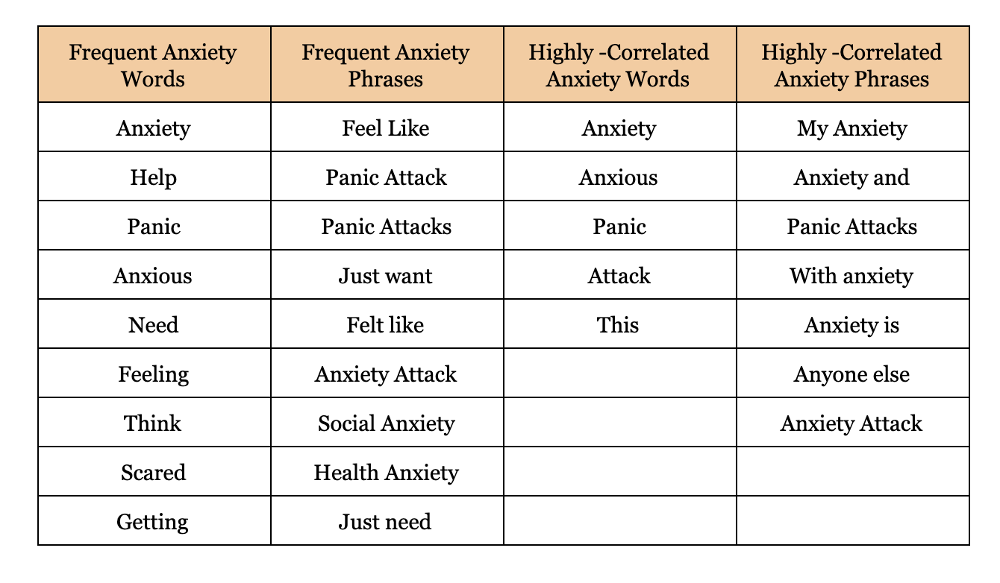
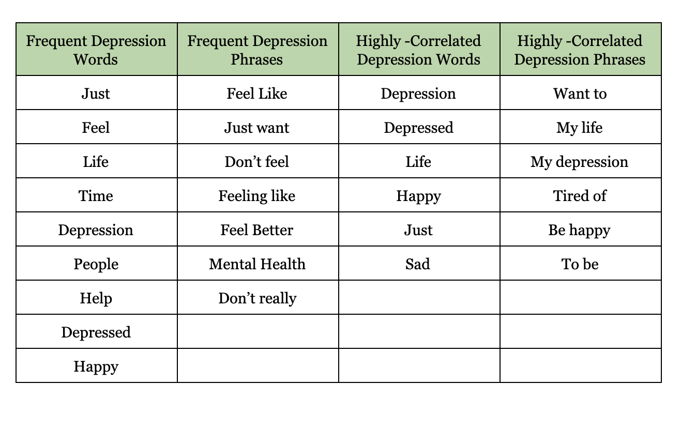

Slides: https://docs.google.com/presentation/d/1qRTneqaEw19StwTPPB5cHl08bqWVkUxrpqXbi_v5ckg/edit#slide=id.g5d274f815f_0_362

# Project 3 - Reddit Web Scraping and the Classification Between Depression and Anxiety
--- 

## **Problem Statement**

#### Problem Statement

- Create a dataset of phrases and words both depressed and anxious people use, and provide justification of choosing those words and phrases.

#### Model Type

- Classification 

#### Model Evaluation 

- To evaluate (or justify) my pool of words, I need to pick the best performing model. I want to mainly focus on my F1 score derived from my confusion matrix. I am focused on accurately classifying the Depression Subreddit; therefore, I can evaluate my model based on the f1 score.  
- The F1 score can be interpreted as the harmonic mean between precision and recall (sensitivity and predicitve positive value), where an F1 score reaches its best value at 1 and worst score at 0. The relative contribution of precision and recall to the F1 score are equal.
- Lastly, I will show the accuracy of each model (train and test scores). 

#### Business Project Context

I work at a Pharmaceutical Company called Pfizer. I was told to communicate with the ad agency by offering a list of words that should be used throughout a variety of advertising formats (catalogue, TV ad, radio, youtube ad). Pfizer wants to launch a collection of advertisements for the new drug Zoloft. This new drug (according to clinical trials) treats both depression and anxiety. My manager wants me to find key words and phrases that anxious and depressed people use in order to create a pool of words for the content writers. 

# Workflow Outline
---
*The following information will outline my workflow in sequential order*

## **Data Collection**

*Note: Enough data was gathered from both subreddits (for each subreddit I extracted ~950 unique blog posts). The objective of this project is to classify subreddits Anxiety and Depression based on the blog post self text. For example, if blog post x had only memes then it would not be qualified for this classification model. My model will classify subreddits based on texts only. To prevent my ip address from being banned, my api scraping for-loop paused for 1 second before scraping the next page. *

**Data Collection**
1. For notebooks `01_Data Collection for ANXIETY.ipynb` and `01_Data Collection for Depression.ipynb` I scraped reddit's api

## **Data Cleaning and EDA**

I made sure my data had selftexts for each subreddit since my model will only use selftexts and titles to classify whether the blog post is from Anxiety or Depression. 

**Data Cleaning and EDA**
1. For the notebook `02_Does our subreddit repost blogs?.ipynb`, I made sure all selftexts for each subreddit was unique. It was also important for me to have the same number of blog posts for each subreddit to avoid class imbalance. I want my machine to know depression just as much as anxiety. 
2. In the notebook `03_Merging Dataframes.ipynb`, I merged both depression and anxiety dataframes and changes the subreddit column. If the subreddit came from depression, it was marked 1 and 0 for anxiety. 
- Note: my baseline score is 51%

## **Preprocessing and Modeling**

I ran multiple tests from tokenizing to parameter tuning. I had the option to stem or lemmatize my tokenized text; I decided to stem since it was the most accurate (see `04_Data Text Cleaning and PreProcessingTHE_ONE.ipynb`). After choosing SnowballStemmer, I decided to add vader sentiment analysis since it brought my f1 score higher. From there, I proceeded with TfidfVectorizer instead of CountVectorizer since it obviously performed better (see `05_Vader StepTHE_ONE.ipynb`). 
From there, I used 5 models: Logistic, Gaussian Naive Bayes, Bernoulli Naive Bayes, Random Forest, and Gradient Booster(see `06_Modeling & Metrics.ipynb`). 

I also tuned my n_gram_range to (1,2) to determine if the model performed better. Unfortunately, it did not perform better; therefore, the n_gram_range is at (1,1) as my best model. 

Let's Summarize the methods I used: SnowballStemmer, Vader, TfidfVectorizer (n_gram_range = (1,1)), LogisticRegression 

#### The following table are results of the 5 models stated above. 

|Classification Regression Model|Train Score|Test Score|F1 Score|
|---|---|---|---|
|Logistic|.941|.883|.879|
|Gaussian|.946|.608|.620|
|Bernoulli|.887|.773|.788|
|Random Forest|.996|.716|.673|
|Gradient Booster|.962|.849|.855|

*Logistic is our best model*

After executing numerous tests, I wanted to execute VotingClassifier to determine if I can achieve a higher f1 score. I picked the three overall best performing models: LogisticRegression, RandomForest, and GradientBooster. To find the ideal parameters for each model, I gridsearched the three models to look for optimal parameters. In the `09_TRANSFORMCLASS.ipynb` notebook, you can see the specific parameters I picked for each model. 

Here are the chosen parameters: 
- LogisticRegression: C = 1, Penalty = l1
- RandomForest: max_depth = 5, max_features = None, n_estimators = 100
- Gradient Booster: learning_rate = 0.1, max_depth = 3, n_estimators = 300

*Note: `09_TRANSFORMCLASS.ipynb` has the appropriate Train, Test, and F1 score. It's best for me to not show you the results since the optimal parameters are for the voting classifier. But I must say RandomForest performed very well when tuning parameters (the F1 score improved by ~18 points). 

By using the parameters above, I was able to create a VoteClassifier to determine the best model for each row in our data. Our scores were decent, but it did not perform better. Check `07_Voting ClassifierTHE_ONE.ipynb` to see the execution of the VoteClassifier.

#### Here is a table comparing the two scores:

|Classification Regression Model|Train Score|Test Score|F1 Score|
|---|---|---|---|
|Logistic|.941|.883|.879|
|VotingClassifier|.971|.868|.871|

## Visualizations 

**The following graphs show frequent words and phrases for anxiety and depression**

#### The following tables show words and phrases with the highest correlation to anxiety and depression

### Anxiety Phrases

### Anxiety Words

### Depression Phrases

### Depression Words

Check `08_AdDirectors.ipynb` to see how I constructed the graphs and tables 

## **Conclusion and Recommendations**

#### Here are the pool of words recommended to the content writers

#### The scores of my modeling that helped me determine best performance. 

|Classification Regression Model|Train Score|Test Score|F1 Score|
|---|---|---|---|
|Logistic|.941|.883|.879|

#### Recommendations

Overall, we found enough words and phrases to help the content creators produce an effective advertisement for Zoloft. 

If I was given more time on this project, I would get the recordings of our test subjects during our clinical trials in order to get more data on the linguistics of people who suffer from anxiety and depression. This method would be more accurate than the Reddit data since we have a team of psychatrists who can appropriately diagnose people who suffer from both depression and anxiety. This route is optimal but it may waste company money and time. 

Nevertheless, I am happy with my results using Reddit data. 

---